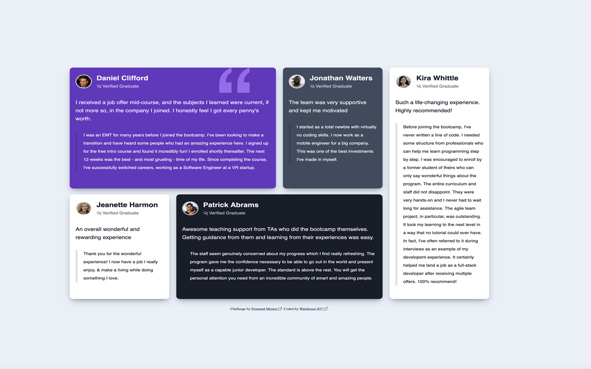

### Screenshot

# Frontend Mentor - Testimonials grid section solution

This is a solution to the [Testimonials grid section challenge on Frontend Mentor](https://www.frontendmentor.io/challenges/testimonials-grid-section-Nnw6J7Un7). Frontend Mentor challenges help you improve your coding skills by building realistic projects.

## Table of contents

- [Overview](#overview)
  - [The challenge](#the-challenge)
  - [Screenshot](#screenshot)
  - [Links](#links)
- [My process](#my-process)
  - [Built with](#built-with)
  - [Useful resources](#useful-resources)
- [Author](#author)

## Overview

### The challenge

Users should be able to:

- View the optimal layout for the site depending on their device's screen size

### Links

- Solution URL: [https://github.com/warehouse827/Testimonials-Grid-Section.git]
- Live Site URL: [https://warehouse827.github.io/Testimonials-Grid-Section/]

## My process

### Built with

- Semantic HTML5 markup
- CSS custom properties
- Grid / Grid Area
- A11Y
- Golden Ratio Text

### Useful resources

- [MDN](https://developer.mozilla.org/en-US/)

## Author

- Website - [https://warehouse827.com](https://warehouse827.com)
- Frontend Mentor - [@warehouse827](https://www.frontendmentor.io/profile/warehouse827)
